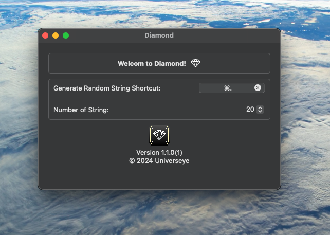
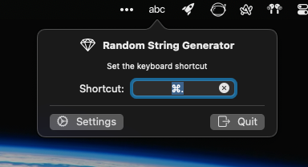

# Diamond: Fast random string generator 

<!---

-->

A native fast random string generator tool for macOS

Free & Open Source

# Download

# Screenshots

  

## Welcome to pull requests for these

* support other languages
* fix bugs

If you have other good ideas 💡, feel free to send an E-mail to me.

## Contributions

* All kinds of contributions (enhancements, new features, documentation & code improvements, issues & bugs reporting & todo task) are welcome. Let's make it better.

## Contact
Developed by [Terry Kuo](https://bento.me/terrykuo)

Feel free to contact me!

## License

MIT
